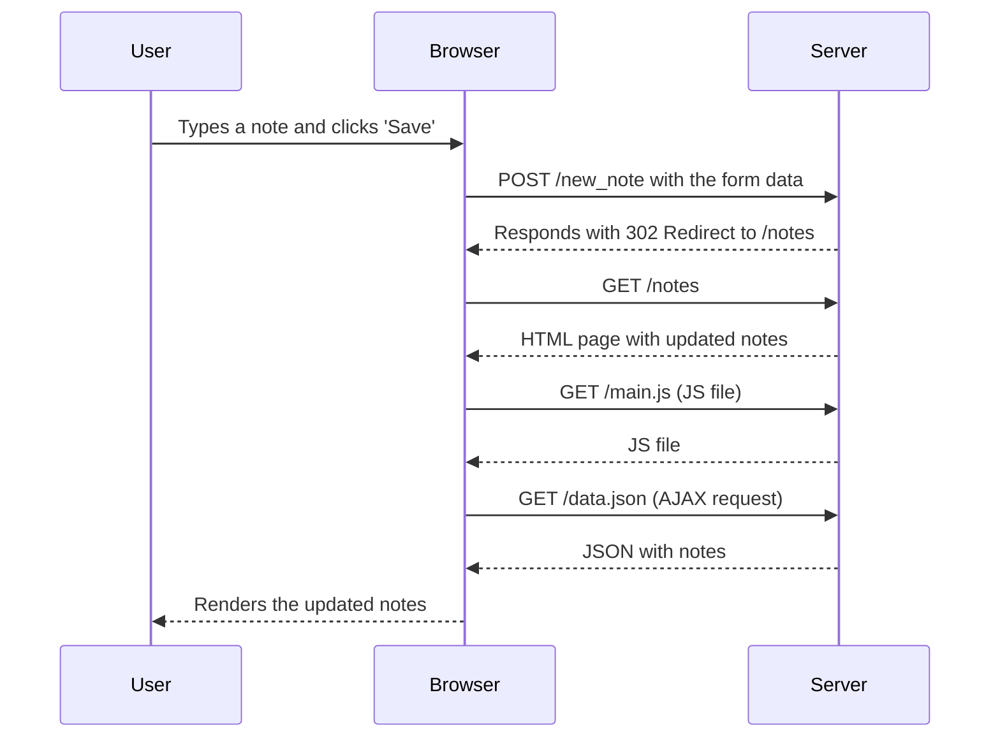

```mermaid
sequenceDiagram
    participant User
    participant Browser
    participant Server

    User->>Browser: Types a note and clicks 'Save'
    Browser->>Server: POST /new_note with the form data
    Server-->>Browser: Responds with 302 Redirect to /notes
    Browser->>Server: GET /notes
    Server-->>Browser: HTML page with updated notes
    Browser->>Server: GET /main.js (JS file)
    Server-->>Browser: JS file
    Browser->>Server: GET /data.json (AJAX request)
    Server-->>Browser: JSON with notes
    Browser-->>User: Renders the updated notes

```

this displays the mermaid diargam that explain how the protocol is established b/w server and browser :)
