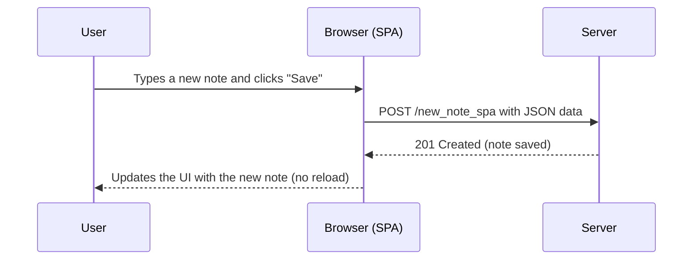

```mermaid
    sequenceDiagram
    participant User
    participant Browser (SPA)
    participant Server

    User->>Browser (SPA): Types a new note and clicks "Save"
    Browser (SPA)->>Server: POST /new_note_spa with JSON data
    Server-->>Browser (SPA): 201 Created (note saved)
    Browser (SPA)-->>User: Updates the UI with the new note (no reload)
```
